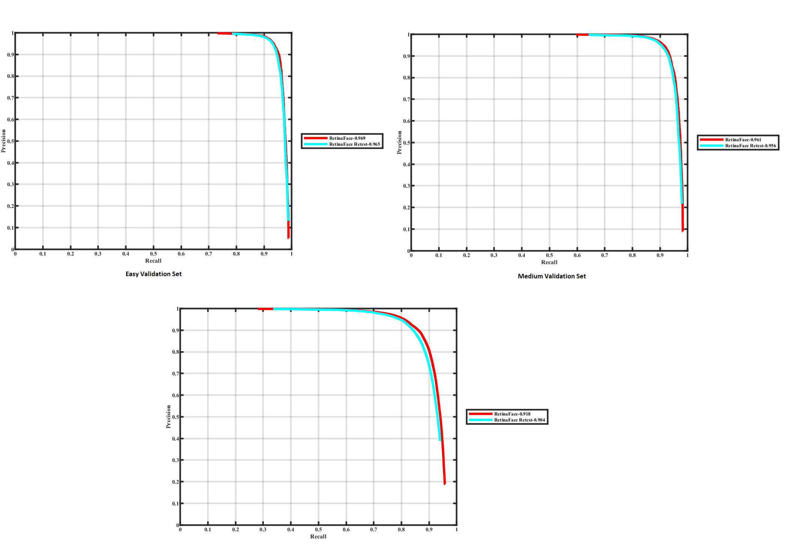
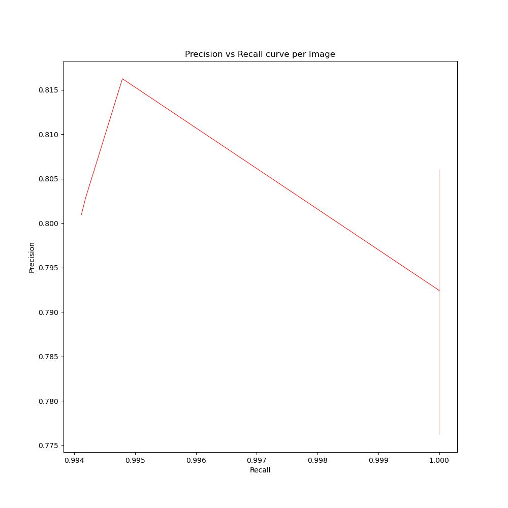

# RetinaFace Face Detector

## Introduction

RetinaFace is a practical single-stage [SOTA](http://shuoyang1213.me/WIDERFACE/WiderFace_Results.html) face detector which is initially introduced in [arXiv technical report](https://arxiv.org/abs/1905.00641) and then accepted by [CVPR 2020](https://openaccess.thecvf.com/content_CVPR_2020/html/Deng_RetinaFace_Single-Shot_Multi-Level_Face_Localisation_in_the_Wild_CVPR_2020_paper.html).

This is a modified repository structured similarly to the original repository which can be found [here](https://github.com/deepinsight/insightface/tree/master/RetinaFace). Group-F has tried to recreate the results obtained by the original code on the WiderFace dataset as well as obtain results on a new dataset created by us. 

## Original Data

1. Download the WiderFace dataset from the drive link [here](https://drive.google.com/file/d/1MNA2D6ClJIttnsbkQwYnf8MMV6HxkFcL/view?usp=sharing). Create a folder `data` and unzip the contents in that folder. 
2. Download the pre-trained model from the drive link [here](https://drive.google.com/file/d/1HAcjUk2DS2L7-05K8uLLq_Gc-XKuUol5/view?usp=sharing). Create a folder `model` and unzip the contents in that folder.
4. Execute the make file to setup the environment.
5. Using a conda environment, install additional dependencies, `pip install mxnet-cu101 opencv-python easydict Cython`.
6. Use the command `python test_widerface.py --prefix './model/R50' --mode=1` to test the pretrained RetinaFace-50 (R50) model on the WiderFace dataset. The outputs will be saved in the `wout` folder. 
7. Move the `wout` folder in `eval/eval_tools` and execute the `wider_eval.m` file to produce the output PR curve graphs. 

## New Data

1. The new dataset is present in the `new_data` folder. It consists of 3 subsets along with a combined set of all images and label files. 
2. To test RetinaFace-50 on this new data, run the command `python test.py new_data/all/img output/all`. This will produce the labels as predicted by RetinaFace-50 in the `output` folder. 
3. Run `python test_output.py output/all/text new_data/all/text all` to produce the PR curves along with MAP values for the new data. 

